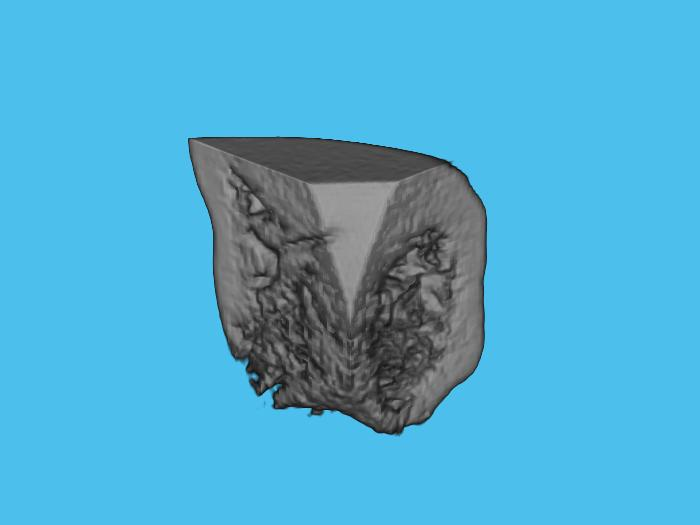
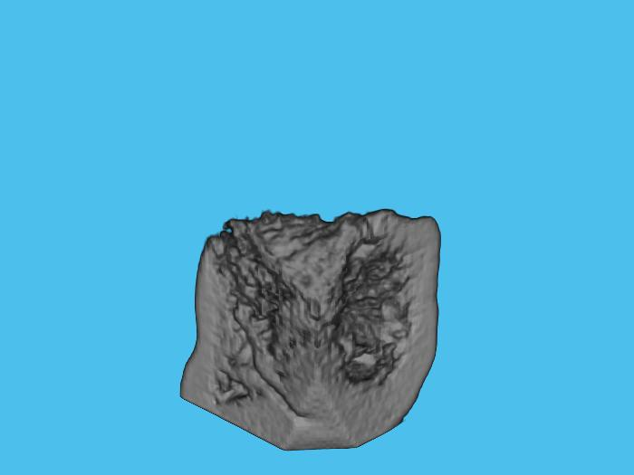
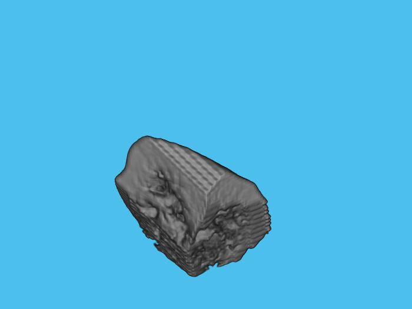

## On-the-fly 3D augmentation for keras fit_generator
* keras `ImageDataGenerator` class works for 2D augmentation. 
* This code performs runtime (on-the-fly) 3D augmentation. 
* It utilizes the `DataGenerator` class described in https://stanford.edu/~shervine/blog/keras-how-to-generate-data-on-the-fly

To do on-the-fly augmentation, set the `do_augmentation` to true.  
Currently, it performs two augmentations - flip and rotation.  
##### Example of how to use rotation: 
'rotate_angle': random.sample(range(-15, 15), 3)  
It will create 3 random rotation angles within the given range. Thus, the size of the rotation angle will be 1x3. For instance, (-10,5,12). Then it will rotate the data about x, y, and z axes by -10, 5, and 12 respectively.  
 
##### Example of how to use flip: 
To flip a data, the user needs to define the `flip_axis` parameter. It could be 1, 2, 3, or 'random'. For 'random', axis will be determined randomly. 

#### Screenshots
Original image  

Flipped image  

rotated image  

#### References
https://stanford.edu/~shervine/blog/keras-how-to-generate-data-on-the-fly